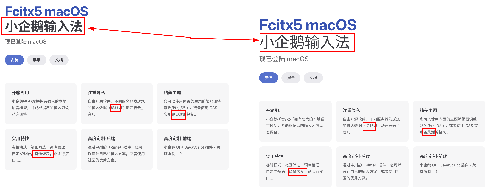

# CJ Font Fallback Fix

[English](README.md) | [简体中文](README.zh-CN.md)

**CJ stands for Chinese and Japanese; Chinese includes both Simplified and Traditional Chinese.** CJ Font Fallback Fix is a Chrome/Chromium extension that helps the browser choose the right regional font for CJK text.

On Linux, a page that neither identifies its language with `lang` nor calls an appropriate font in CSS may render CJK text requested in bold using a Regular face. The extension helps Chrome use the correct bold face and can select a Chinese font even when a Chinese page is marked `lang="en-US"`. This problem is more common on Chinese sites; Japanese sites are more likely to declare `lang="ja"`.

On macOS and Windows, CJK bold text generally works already. The extension is still useful when a Chinese or Japanese page has no language declaration or is mislabeled `en-US`. In those cases, it helps the browser choose the right regional font. It is intended for readers who move between Chinese and Japanese sites, including Japanese learners who also read Chinese pages.



The page in this example is marked `lang="en-US"`. With the extension enabled (left), Chrome uses the appropriate Chinese font and bold weight. Without it (right), the text falls back to Regular.

## How it works

The extension handles **Simplified Chinese, Traditional Chinese, and Japanese**. A manual choice for a hostname takes precedence. With **Trust specific Chinese and Japanese language declarations** enabled (the default), a specific CJK `lang` on the root is trusted, and a descendant with its own `lang` is left to the browser even if that language is outside the extension's scope. The extension does not rewrite those elements' font CSS. Otherwise, page-level detection uses a bounded text sample and the browser's language detector, supplemented by kana and simplified/traditional character clues. Bare root `lang="zh"` still needs Chinese script clues; if those cannot resolve the variant, **Default Chinese variant** decides. Shared Han characters and very short samples remain ambiguous.

**Advanced mode**, the default, keeps the site's named fonts and changes their order only when needed. Normally, the selected font follows named families and goes just before the first generic family such as `sans-serif`. If a reachable named CJK family is recognized as belonging to the wrong region, the selected font moves ahead of the recognized regional families while retaining the site's Latin and unclassified families. The first generic family determines whether the Serif choice is used (`serif` or `ui-serif`); otherwise the Sans choice is used. In schematic form:

```text
Website Latin font, Unclassified site font, sans-serif
→ Website Latin font, Unclassified site font, Selected font, sans-serif

Website Latin font, Recognized SC font, sans-serif  [Japanese content]
→ Website Latin font, Selected JP font, Recognized SC font, sans-serif
```

These are ordering diagrams, not literal CSS family names or platform-specific font assumptions. With the preservation options enabled, a suitable site-loaded CJK font or suitable available named CJK font normally prevents insertion altogether. A manual site choice takes precedence over the site's language declaration.

**Simple mode** is opt-in. It changes only the root `lang` to `zh-CN`, `zh-TW`, or `ja` and does not inject per-element font CSS. The browser and operating system choose the actual font, so the font choices in Settings do not apply. It briefly watches for content rendered at startup, then stops once a language is found or after two seconds.

Advanced mode also has **Detect clearly separated Chinese and Japanese text blocks (experimental)**, off by default. It activates only for automatically classified pages without a specific root CJK `lang` and with substantial evidence of both languages; a manual site choice keeps it off. Once active, it can choose different fonts for high-confidence direct text segments, including standalone kana or kana mixed only with recognized Japanese-form Han characters. It does not change `lang` or the page-level result, does not split ordinary text at spaces, and leaves uncertain segments on the page result. Some multi-segment elements need temporary spans; turning the option off removes those spans, although adjacent text nodes may be merged.

## Fonts and settings

Under **Settings → Font choices**, you can preview and choose Sans and Serif fonts for Simplified Chinese, Traditional Chinese, and Japanese. The menus list fonts reported as installed by the browser. Defaults are selected from available regional candidates; on Linux, Noto Sans CJK is preferred when installed. Leaving a Serif choice at **Same as Sans** uses that language's Sans choice. Changes save automatically to browser sync storage.

The separate options **Keep suitable Chinese/Japanese fonts loaded by the website** and **Keep suitable installed Chinese/Japanese fonts named by the website** protect usable website fonts and installed named fonts, respectively. When either finds a suitable font for the current language, the extension does not place your selected font ahead of it. A known wrong-region family does not block the correction; an available Fangsong face is protected for Chinese text, but not ahead of a Japanese font for Japanese text.

With **Watch and re-detect dynamic pages** enabled (the default), Advanced mode responds to relevant content and language changes. Disabling it keeps the initial page-language result fixed; the extension can still react to font loading. Elements with the same final font stack share a CSS rule instead of carrying duplicate inline styles. The extension starts before all page fonts finish loading and avoids repeated full language detection on pages without CJK text.

The popup lets you set a site to **Auto, Simplified Chinese, Traditional Chinese, Japanese, or Disabled**. Site choices are stored by hostname and can be viewed, added, edited, or removed under **Manage site language settings**. Auto removes an override rather than storing an Auto value. **Delete all site settings** clears only site choices; the main **Restore defaults** action does not.

The interface follows the browser's language: English, Japanese, Simplified Chinese, or Traditional Chinese. If the browser language is not supported, the interface uses English. There is no separate language picker.

## Checking the current page

Click the toolbar icon to see **HTML lang**, the page's selected or detected variant, and whether the extension intervened. The **Mode** row identifies **Advanced · Font correction** or **Simple · lang only**. Advanced mode also shows **Applied fonts** (configured families the extension actually added to CSS), **CSS intervention**, and **Managed elements**. These report what the extension did, not the physical font Chromium rendered for every glyph. Simple mode shows **Applied lang** instead. If experimental mixed-language detection finds local variants, the detection row lists them alongside the stable page-level result.

The icon reflects **use on the current page**: the book opens when Advanced mode manages at least one font change or Simple mode applies a root `lang`. Simple mode counts as applied even if the root already has the same value. Otherwise the book stays closed. Chrome internal pages, the Chrome Web Store, and some other protected pages do not permit content scripts.

## Installation

1. Extract the release ZIP.
2. Open `chrome://extensions` and turn on **Developer mode**.
3. Click **Load unpacked** and select the extracted folder.
4. Open the extension's **Settings** to check or adjust the font choices.

To build from source, run `npm ci` and `npm run build`, then load the generated `dist` directory. For a GitHub Release, download the attached `cj-font-fallback-fix-<version>.zip`; GitHub's automatically generated **Source code (zip)** is source only, not the built extension.

## Development and limits

The source uses TypeScript, Vite, and Manifest V3, with no third-party runtime dependencies. See the [architecture guide](docs/architecture.md) for the modules and runtime flow, [design decisions](docs/decisions.md) for intentional constraints, and [testing notes](docs/testing.md) for browser checks.

```sh
npm install
npm test
npm run test:sites
npm run build
```

`npm test` runs local unit tests. `npm run test:sites` checks a local SPA fixture and several live sites in Chromium; the full site suite needs internet access and can be affected by site changes. The optional `npm run test:corpus` uses a locally supplied FLORES-200 archive via `CJ_FLORES_DIR`; its text is not committed or bundled. See the [testing notes](docs/testing.md) for setup and limits. `npm run build` checks TypeScript and produces a loadable extension in `dist`.

GitHub builds release assets from the tagged source via [Build and release](.github/workflows/release.yml). After committing a version update to `main`, run that workflow from the Actions tab on `main`; it checks the package and manifest versions, runs `npm ci`, unit tests and type checks, builds the extension, then creates the matching `v<version>` tag and Release with the ZIP attached. Pushing a matching version tag also triggers it. Do not create an empty Release first: the workflow creates the Release after the build passes. Live-site and optional corpus tests are not part of this release workflow.

The extension cannot ask Chromium which physical font rendered **each glyph**. It relies on the page's CSS, font metadata, and local availability instead. A few shared Han characters cannot reliably identify a region, and the experimental mixed-language option does not cover every inline layout. Discovered open shadow roots can be handled; closed shadow roots cannot be inspected.

## License

The source code, original icon artwork, and documentation text are licensed under [GNU GPLv3](LICENSE) (`GPL-3.0-only`). The [comparison screenshot](docs/images/bold-chinese-before-after.png) depicts a third-party website and is **not** covered by that license; this project does not grant rights to reuse the website content shown in it.

The built extension in `dist` contains the files needed to run it and a copy of the license, but not the READMEs, development docs, or comparison screenshot. The release workflow tags the exact source revision used for its ZIP.
